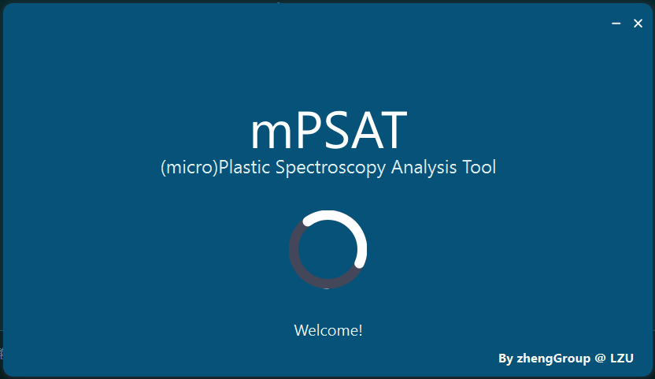
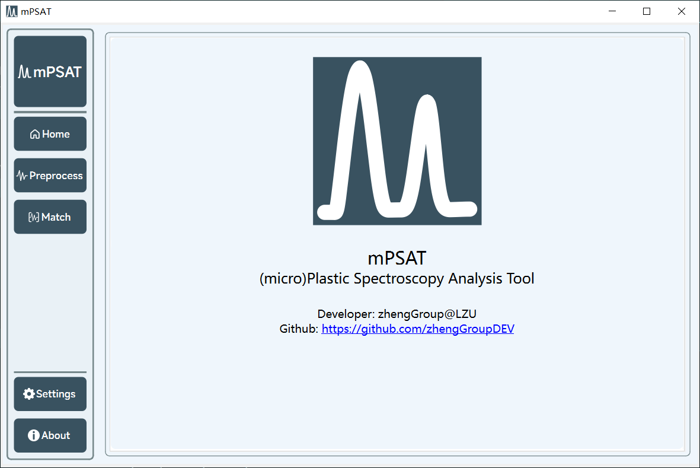
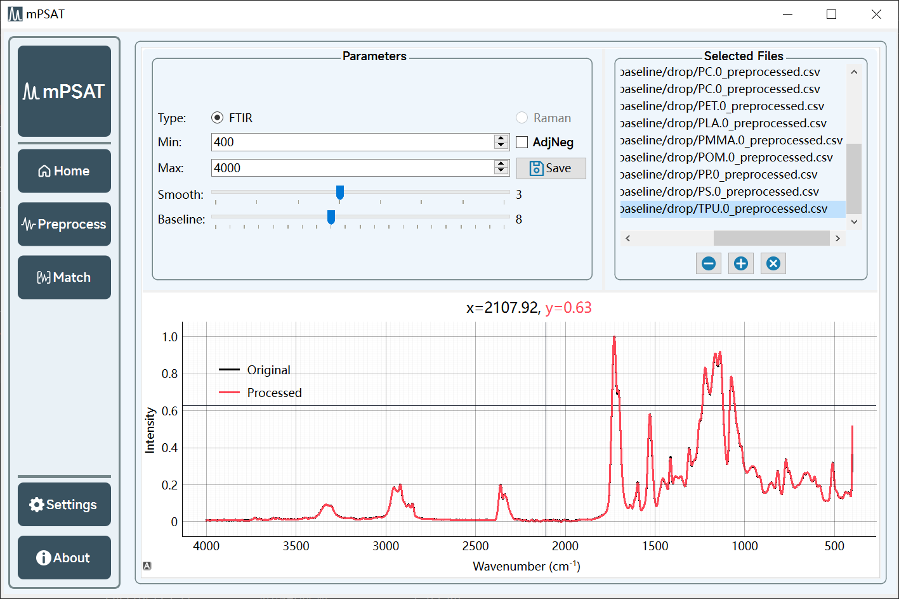
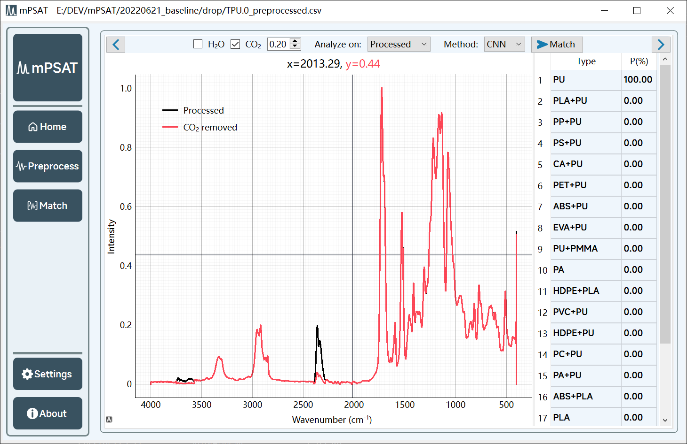

# mPSAT

A (micro)plastic spectroscopy analysis tool - mPSAT

The backend of this program is available at [mPSAT-backend](https://github.com/zhengGroupDEV/mPSAT-backend).

## Previews

## Usage

1. Download prebuilt binary file from Release.
2. Downlaod `.onnx` models.
3. Open program and set correct path to `.onnx` modles.
4. click `+` at `preprocess` tab to add spectra, note the spectra must have **TWO** columns, which are wavenumbers and intensities, you can find an example file at `examples/PU.csv`.
5. Switch to Match tab and set your parameters, especially select the correct model you want to use, than click Match.
6. The predicted classes as well as probabilities will show at the right of graph now.

If you meet any problems, you can open an issue and we will try to fix it.

## Build from Source

1. Check the `build.py` to find how to build from source.
2. Refer to [Nuitka](https://github.com/Nuitka/Nuitka) to customize the build options.

## Developer

Developer: zhengGroup@LZU

## License

Apache License, more info [here](README.md)
