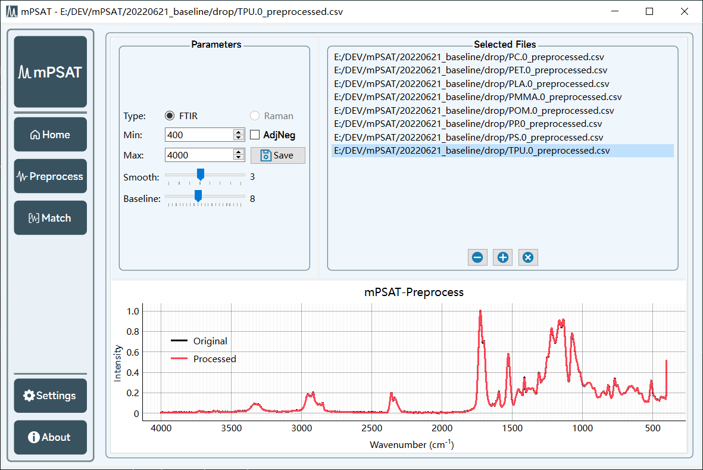
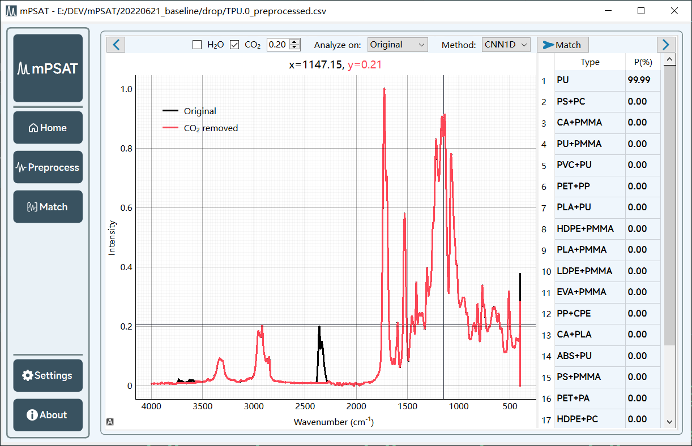

# mPSAT

A (micro)plastic spectroscopy analyze tool - mPSAT

The backend of this program is available at [mPSAT-backend](https://github.com/zhengGroupDEV/mPSAT-backend).

## Previews

## Developer

Developer: zhengGroup@LZU

## License

Apache License, more info [here](README.md)
